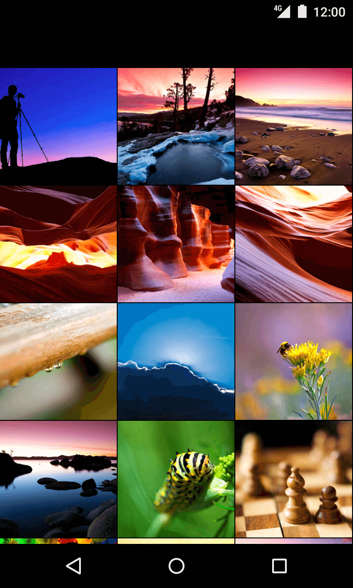

# Addison Global Native Technical Assesement

## Introduction

Welcome to Addison Global Native Technical test.

The main goal of this exercise is to create a **Native UI Component** and bridge it to React Native so it can be invoked from Javascript.

We're specifically interested in how you reason about the problem and you're ability to write clean and performant code. There's no hard rules or tricky questions.

**We hope you have fun.**

## Brief

This exercise consists in building a native photo grid view for **either** Android **or** iOS and expose it, through a native UI component, to React Native.



The native view, PhotoGridView, should be exposed to React Native so it can be used on the Application code. **It should take an array of image URLs as parameters and render them on a 3 column grid as displayed on the example.**

Additionally, it should handle the following component properties:

* **onLoadEnd**: method called when **each** image finishes loading. Called with the image `URL` and a boolean indicating if the image loaded successfuly.
* **onPress**: method called when an image is pressed. It should be called with the `url` of the image that was clicked.

### React Native Component Example

```js
import React from 'react';
import PhotoGridView from 'react-native-photo-grid-view';

const photos = [
    'https://picsum.photos/600/600/',
    'https://picsum.photos/500/500/',
];

function App () {
    return (
        <PhotoGridView
            data={photos}
            onLoadEnd={(image, succeeded) => {
                // log success if succeeded, fail otherwise
                const msg = succeeded ? 'yay' : 'nay';

                if (succeeded) {
                    console.info('yay');
                } else {
                    console.warn('nay', image);
                }
            }}
            onPress={(url => Alert.alert(
                'Img Clicked',
                url,
            ))}
        />
    );
}
```

The code above essentially creates a App React component which includes the PhotoGridView Native component passing an array of `photos` as the data source. Additionally we pass a callback to both onLoadEnd and onPress to handle each event accordingly.

**Please ensure images are cached and large images are handled in a performant manner.**

## Getting started

> To get you started faster, we provide an application skeleton containing a React Native application and the skeleton for the native module.

1. Clone this repo

```bash
git clone git@github.com:addisonglobal/native-technical-test.git
```

2. Install [Yarn package manager](https://yarnpkg.com/en/docs/install)
3. If NodeJS is not installed, install [NVM](https://github.com/creationix/nvm) and then run `nvm install 8 && nvm alias default node`
4. Bootstrap the project

```bash
yarn install && yarn bootrap
```

5. Navigate to the app folder and start the project

```bash
cd packages/app
yarn start
```

6. Run the application on a device

* Android

```bash
yarn android
```

* iOS

```bash
yarn android
```

> You can also run the app through `xcode` or `Android Studio`. See [Building Projects with Native Code]((https://facebook.github.io/react-native/docs/getting-started.html)) section of the docs.

If you run into issues, please refer to [React Native troubleshooting guide](https://facebook.github.io/react-native/docs/troubleshooting.html#content) and try to [clear the packager cache](https://gist.github.com/EQuimper/a14c19461b7018dabca2dd6c3f123671). You can also [open an issue in this repository](https://github.com/addisonglobal/native-technical-test/issues/new) and we'll get back to you ASAP.

## The task

As previously mentioned you'll need to create a 3 column Native Grid View for iOS or Android which will receive the images to be rendered from React Native (JS context) and emit the events `onLoadEnd` and `onPress` back.

Under the [packages](./packages) folder, you'll find two packages:

* `app` - React Native App already prepared.
* `PhotoGridView` - Native UI Component boilerplate.

When you load the App on the simulator, you'll see the text "Hello from Native". This text is being rendered as a Native view. You'll need to replace that dummy code with your Native Photo Grid View implementation. This code can be found under [App.js](./packages/app/App.js).

> The Native UI Component boilerplate provided uses Objective-C and Java for iOS and Android respectively. If you wish to use other languagues, we recommend that you take a look at [react-native-create-bridge](https://github.com/peggyrayzis/react-native-create-bridge).

### Additional Information

If it's your first time creating a React Native module, we recommend that you take a look at the relevant docs:

#### iOS

* Native UI Components: https://facebook.github.io/react-native/docs/native-components-ios.html
* Linking Libraries: https://facebook.github.io/react-native/docs/linking-libraries-ios.html
* Bridge Communication: https://facebook.github.io/react-native/docs/communication-ios.html

#### Android

* Native UI Components: https://facebook.github.io/react-native/docs/native-components-android.html

## Data

The boilerplate is fetching images from NASA Astronomy Picture of the Day API. You just need to handle the rendering of the array of URLs passed to your Native UI Component.

If you wish to see the code that fetches the data and passes it to the Native UI Component you can see [App.js](./packages/app/App.js).

You can also query the public API used to feed the data into the application:
https://api.nasa.gov/planetary/apod?api_key=DEMO_KEY&count=42

Please note that initially the list of images will be an empty array and only when the API request finishes, the photo URLs will be available.

## Technology

You can use of of the following languages:

* **iOS**: Objective-C or Swift
* **Android**: Java; Kotlin or Scala

## The Deliverable

* A bundled/archived repository showing your commit history or a link to an accessible private repository with your work in (Github can host private repositories at a cost; there is no charge for doing so with Bitbucket). Git example for sending us a standalone bundle:

      git bundle create <yourname>.bundle --all --branches

* A Readme.md file explaining the decisions you've made solving this task including technology and library choices.
* Any instructions required to run your solution and tests in a Linux environment.

